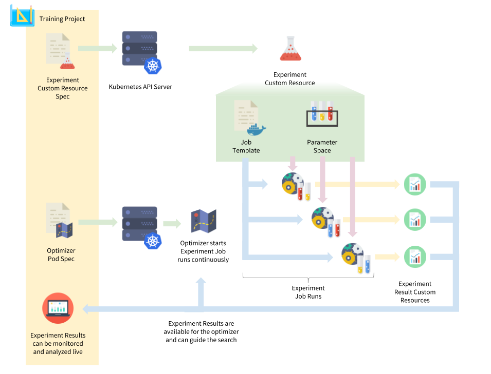

# experiments

Training a deep neural network requires finding a good combination of model hyperparameters. The process of finding the good values for each is called hyperparameter optimization. The number of jobs required for each such experiment typically ranges from the low ones into the hundreds.

Individual workflows for optimization vary, but this is typically an ad-hoc manual process including custom job submit scripts or even pen and paper.

This project provides an API for experiments, aims to standardize metadata associated with each experiment's jobs and ease integration with the experiment tracking system via a python client library.

This is done through moving the experiment context into a shared API to promote sharing results and the development of tooling and decoupling parameter space search from job execution.



## Prerequisites

 - git
 - make
 - python
 - kubectl and a connected cluster (minikube or a full cluster)

## Installation

To install, run the following:
```
$ git clone https://github.com/NervanaSystems/experiments.git
$ cd experiments
$ pip install .
```

## Development

To test the experiments API, run the following:
```
$ pip install -r requirements_tests.txt
$ make test
``` 

## Appendix

### Concepts

**Experiment** Describes a hyperparameter space and how to launch a job for a sample in that space. Has a unique name.

**Optimizer** A program that reads an experiment and creates jobs with different hyperparameter settings. This can be done all in one shot, or the optimizer could be a long-running coordinator that monitors the performance of various samples to direct the hyperparameter optimization process. This program is supplied by the user.

**Result** Encodes metadata about a single job run for an experiment. For example, a handful of high level metrics per training epoch and a pointer to an output directory on shared storage. There is one result resource per job. Each result has the same name as the job it represents.